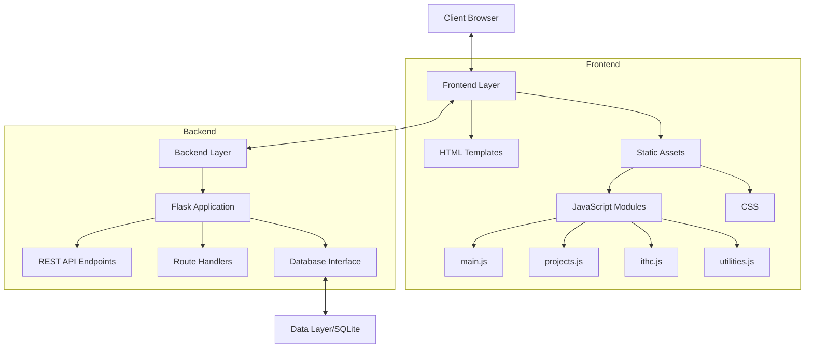
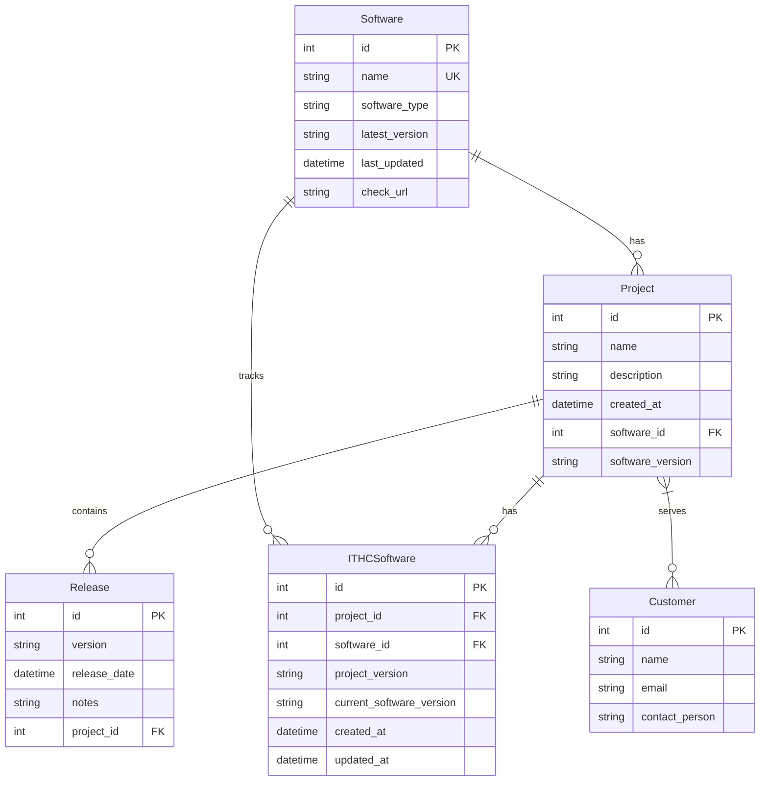
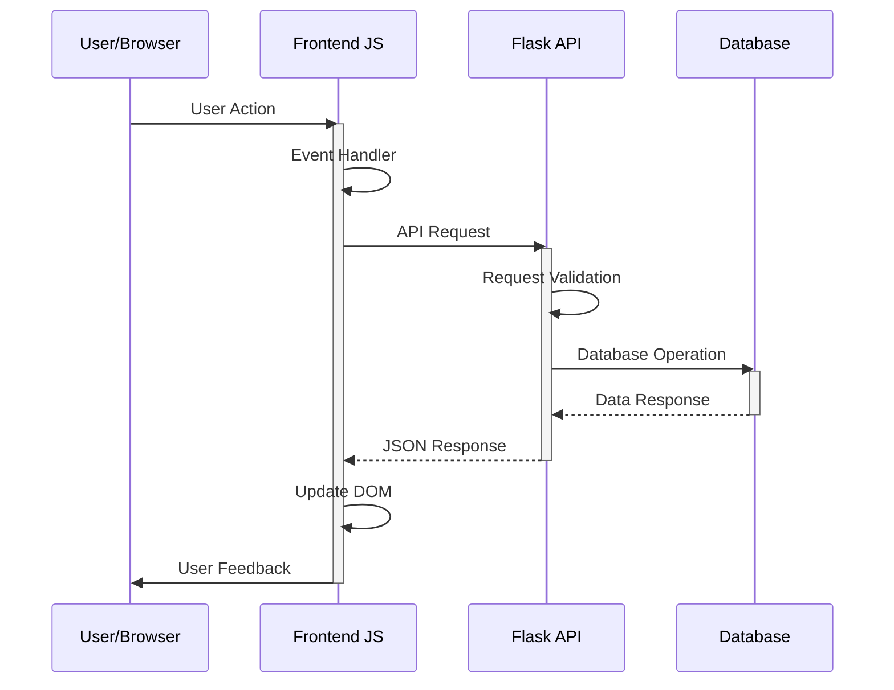

# Software Management System

A web-based application for managing software versions, projects, and customer relationships.

## Architecture Diagrams

### Application Architecture


### Data Model


### Code Flow (Typical Request)


## Features

- Software Management
  - Track software versions and metadata
  - Record software types and latest versions
  - Store URLs for version checking
  - Search and filter software entries
  - Edit and delete software entries

- Project Management
  - Create and manage projects with versions
  - Track project descriptions and status
  - Manage project releases with versioning
  - Associate software versions with projects
  - Edit and delete project entries
  - Search projects functionality

- Customer Management
  - Manage customer information
  - Associate customers with projects
  - Track customer contact details
  - Add/remove customers from projects

- ITHC (IT Health Check) Management
  - Track software versions across projects
  - Compare current vs latest versions
  - Project version management
  - Software version auditing
  - Version history tracking

- Bulk Import/Export
  - Excel import for software entries
  - Excel import for project data
  - Excel import for customer data
  - Excel import for ITHC data
  - Download template files

## Technology Stack

### Backend
- Python 3.x
- Flask 3.0.0
- SQLAlchemy ORM
- SQLite database
- Flask-Migrate for database migrations
- Pytest for testing

### Frontend
- HTML5/CSS3
- JavaScript (ES6+)
- Bootstrap 5.3.0
- Bootstrap Icons
- Jest for testing
- Testing Library for DOM testing

## Prerequisites

1. Python 3.x (The project uses Flask 3.0.0)
2. Node.js (for frontend development and testing)
3. Git
4. SQLite (included with Python)
5. npm (Node Package Manager)

## Setup Instructions

### 1. Clone the Repository

```bash
git clone <repository-url>
cd ITHCSoftwareApp
```

### 2. Backend Setup

1. Create and activate a Python virtual environment:
```bash
python -m venv venv

# On Windows
venv\Scripts\activate

# On macOS/Linux
source venv/bin/activate
```

2. Install backend dependencies:
```bash
cd backend
pip install -r requirements.txt
```

3. Initialize the database:
```bash
flask db upgrade
```

### 3. Frontend Setup

1. Install frontend dependencies:
```bash
cd ../frontend
npm install
```

## Running Tests

### Backend Tests

From the backend directory:
```bash
# Run all tests
pytest

# Run tests with coverage report
pytest --cov=.

# Run specific test file
pytest tests/test_software.py
```

### Frontend Tests

From the frontend directory:
```bash
# Run all tests
npm test

# Run tests in watch mode
npm run test:watch

# Run tests with coverage
npm run test:coverage
```

## Project Structure

```
backend/
├── app.py              # Main Flask application
├── models/            # Database models
│   └── software.py    # Core data models
├── migrations/        # Database migrations
├── tests/            # Backend test files
└── requirements.txt   # Python dependencies

frontend/
├── static/
│   ├── css/          # Stylesheets
│   └── js/           # JavaScript modules
│       ├── main.js       # Software management
│       ├── projects.js   # Project management
│       ├── ithc.js      # ITHC functionality
│       └── utilities.js  # Import/Export features
├── templates/        # HTML templates
└── tests/           # Frontend test files
```

## Running the Application

1. Start the backend server:
```bash
cd backend
flask run
```

2. Access the application at `http://localhost:5000`

## Development Notes

- The application uses SQLite for development. The database file is created at `backend/instance/software.db`
- Frontend JavaScript is organized into modular files for each major feature
- Bootstrap is used for responsive UI design
- The application implements RESTful API patterns
- Database migrations handle schema changes
- Both frontend and backend have comprehensive test coverage

## API Endpoints

### Software
- GET /api/software - List all software
- POST /api/software - Add new software
- PUT /api/software/<id> - Update software
- DELETE /api/software/<id> - Delete software
- POST /api/software/import - Import software from Excel

### Projects
- GET /api/projects - List all projects
- POST /api/projects - Create new project
- PUT /api/projects/<id> - Update project
- DELETE /api/projects/<id> - Delete project
- POST /api/projects/<id>/releases - Add project release
- POST /api/projects/import - Import projects from Excel

### ITHC
- GET /api/ithc/software - List ITHC entries
- POST /api/ithc/software - Add ITHC entry
- PUT /api/ithc/software/<id> - Update ITHC entry
- DELETE /api/ithc/software/<id> - Delete ITHC entry
- POST /api/ithc/software/import - Import ITHC data from Excel

### Customers
- GET /api/customers - List all customers
- POST /api/customers - Add new customer
- POST /api/customers/import - Import customers from Excel
- POST /api/projects/<id>/customers/<id> - Add customer to project

## Troubleshooting

### Database Issues
- If you encounter database errors, try removing the `instance/software.db` file and running `flask db upgrade` again
- Check database migrations in `backend/migrations/versions`

### Frontend Issues
- Clear Jest cache: `npm test -- --clearCache`
- Ensure all dependencies are installed: `npm install`
- Check browser console for JavaScript errors
- Verify Bootstrap is properly loaded

### Backend Issues
- Ensure virtual environment is activated
- Verify all requirements are installed: `pip install -r requirements.txt`
- Check `flask run` output for errors
- Verify database connection

## Contributing

1. Fork the repository
2. Create your feature branch (`git checkout -b feature/AmazingFeature`)
3. Commit your changes (`git commit -m 'Add some AmazingFeature'`)
4. Push to the branch (`git push origin feature/AmazingFeature`)
5. Open a Pull Request

## License

This project is licensed under the MIT License - see the LICENSE file for details.